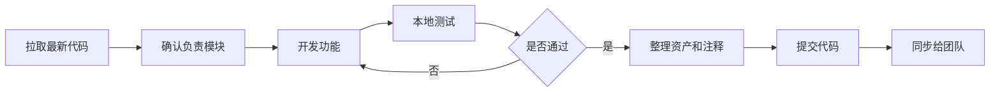
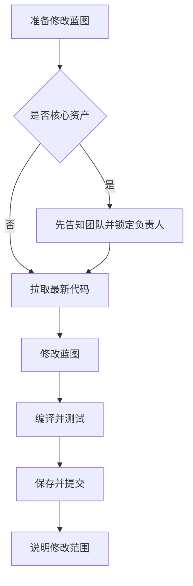

# FateOfTheKingdom

《FateOfTheKingdom》是一个基于 Unreal Engine 开发的项目。当前阶段以前期蓝图开发为主，后续可能逐步引入 C++、插件、复杂资源管线和多人协作流程。

本文档用于统一团队开发规则、提交规则、命名规范和冲突处理方式。所有成员在提交前都应先阅读并遵守本 README。

---

## 一、开发准则

### 1. 基本原则

1. 每次提交只做一类事情，避免把功能、重命名、删除资产、整理目录混在一起。
2. 修改蓝图前先确认自己负责的模块，尽量不要多人同时编辑同一个 `.uasset`。
3. 不提交 Unreal 自动生成目录，例如 `Binaries/`、`DerivedDataCache/`、`Intermediate/`、`Saved/`。
4. 不提交个人 IDE 状态、临时文件、日志文件和本地缓存。
5. 提交前必须打开 Unreal Editor 检查关键蓝图是否能正常编译。
6. 重要资产删除、重命名、移动目录前，必须先在团队内说明。

### 2. 蓝图开发原则

前期以蓝图开发为主，因此蓝图资产是最容易产生冲突的部分。蓝图文件属于二进制资产，Git 很难像文本代码一样自动合并，所以协作时要尽量避免多人同时改同一个蓝图。

推荐做法：

1. 按功能拆分蓝图，不把所有逻辑堆在一个大型蓝图中。
2. 通用逻辑优先放到 `Blueprint Function Library`、`Actor Component` 或独立子蓝图中。
3. UI、角色、关卡、战斗、AI、数据配置尽量拆到不同资产中维护。
4. 同一个蓝图短时间内只由一个人负责修改。
5. 修改核心蓝图前，在群里或任务看板中标记“我正在改这个资产”。
6. 蓝图变量、函数、事件、宏都必须命名清晰，避免 `NewVar_0`、`Function_1`、`Temp` 这类名称。
7. 提交前清理无用节点、断开的线、废弃变量和测试用 Print String。
8. 蓝图中复杂逻辑需要加注释框，说明这段逻辑的目的。

### 3. 资源目录原则

建议 `Content/` 下按功能分区，不把所有资产直接放在根目录。

推荐结构：

```text
Content/\
  --GamePlay母文件[存放游戏的主菜单关卡]
  --Project母文件[存放以下所有子项文件]
  --子文件：PublicFile[颜色标记为红色，它是公共文件从，存放通用的蓝图逻辑比如关键字static类型]
  --子文件：Wenqiu[个人文件，英文命名，颜色自定义]
  --子文件结构如下：
{
  Core/             项目核心通用资产
  Characters/       角色、动画、角色蓝图
  Maps/             关卡
  UI/               用户界面
  Gameplay/         玩法相关蓝图
  AI/               AI、行为树、黑板
  Data/             DataTable、DataAsset、配置资源
  Materials/        材质和材质实例
  Meshes/           模型
  Textures/         贴图
  Audio/            音频
  VFX/              特效
  Developer/        个人测试内容，不建议长期保留
}
```

`Developer/` 目录只放个人实验内容，正式功能完成后应移动到正式目录。

---

## 二、提交规则

### 1. 提交标题

提交标题使用“图标 + 双引号主题 + 版本序列号”的形式，版本序列号的递增。主题要简洁明确。

示例：

```text
*✅为特殊图形，它的示例：✅ 版本x.xx.x “更新提交规则”-2026515 --包含时间结尾，以下真实案例
✅ 版本0.00.1 “更新和完善README.md文件”-2026515

⚠️“修复敌人追击逻辑但仍有边界问题”
❌“新增背包蓝图未测试”
🍀“发布首个可运行Demo”
🚧“标记战斗系统待优化项”
🛠️“扩展交互组件功能”
```

### 2. 提交描述

提交描述需要说明修改、新增、删除、待处理内容。建议按图标分组描述。

示例：

```text
✅
1. 完成 BP_PlayerCharacter 基础移动逻辑
2. 完成 IA_Move 输入映射测试

🛠️
1. 扩展 BP_InteractComponent，支持交互距离配置

⚠️
1. BP_EnemyAI 在障碍物附近仍可能卡住，需要后续优化
```

### 3. 图标含义

| 图标 | 含义 | 使用场景 |
| :--: | :-- | :-- |
| ✅ | 完成 | 功能已完成，并经过基础测试，没有发现明显问题 |
| ⚠️ | 有风险 | 功能已修改或测试过，但仍存在已知问题 |
| ❌ | 未测试 / 废弃 | 新增功能未测试，或说明废弃资产 |
| 🍀 | 版本发布 | 一次较大的版本发布，已通过整体测试 |
| 🚧 | 待优化 | 标记需要优化的问题、临时方案或技术债 |
| 🛠️ | 扩展 | 在原有功能上扩展能力，而不是完全重写 |

### 4. 提交前检查

提交前请确认：

1. Unreal Editor 中没有蓝图编译错误。
2. 修改过的关卡、蓝图、UI 可以正常打开。
3. 没有提交 `Saved/`、`Intermediate/`、`DerivedDataCache/` 等生成目录。
4. 没有提交本地测试截图、日志、临时备份文件。
5. 提交描述写清楚了修改的资产和影响范围。

---

## 三、分支规则

### 1. 分支命名

推荐使用以下格式：

```text
feature/功能名
fix/问题名
refactor/重构内容
release/版本号
test/测试内容
```

示例：

```text
feature/player-movement
feature/enemy-ai
fix/ui-health-bar
refactor/interaction-system
release/demo-0.1
```

### 2. 分支使用原则

1. `main` 或 `master` 分支只保留稳定版本。
2. 新功能在 `feature/*` 分支开发。
3. 修复问题在 `fix/*` 分支开发。
4. 合并前先同步主分支，确认没有冲突和明显错误。
5. 大型功能不要一次性提交太久，建议阶段性提交，方便回溯。

---

## 四、命名规则

### 1. Unreal 资产命名

Unreal 资产使用“类型前缀 + 清晰名称”的形式。

| 类型 | 前缀 | 示例 |
| :-- | :-- | :-- |
| 蓝图类 | `BP_` | `BP_PlayerCharacter` |
| 蓝图接口 | `BPI_` | `BPI_Interactable` |
| Actor Component | `BPC_` | `BPC_Health` |
| Widget 蓝图 | `WBP_` | `WBP_MainHUD` |
| GameMode | `GM_` | `GM_Main` |
| GameState | `GS_` | `GS_Battle` |
| PlayerController | `PC_` | `PC_Main` |
| PlayerState | `PS_` | `PS_Player` |
| AIController | `AIC_` | `AIC_Enemy` |
| 行为树 | `BT_` | `BT_EnemyMelee` |
| 黑板 | `BB_` | `BB_Enemy` |
| 枚举 | `E_` | `E_WeaponType` |
| 结构体 | `ST_` | `ST_ItemData` |
| DataTable | `DT_` | `DT_ItemList` |
| DataAsset | `DA_` | `DA_WeaponConfig` |
| 材质 | `M_` | `M_StoneWall` |
| 材质实例 | `MI_` | `MI_StoneWall_Dark` |
| 静态网格 | `SM_` | `SM_CastleWall` |
| 骨骼网格 | `SK_` | `SK_Hero` |
| 纹理 | `T_` | `T_Hero_Diffuse` |
| 音效 | `SFX_` | `SFX_SwordHit` |
| 音乐 | `BGM_` | `BGM_BattleTheme` |
| 粒子 / Niagara | `NS_` | `NS_FireImpact` |
| 关卡 | `Level_` | `Level_MainMenu` |
| 输入动作 | `IA_` | `IA_Jump` |
| 输入映射 | `IMC_` | `IMC_Player` |

### 2. 蓝图内部命名

| 类型 | 规则 | 示例 |
| :-- | :-- | :-- |
| 变量 | PascalCase 或清晰英文名 | `CurrentHealth` |
| 布尔变量 | 使用 `b` 前缀 | `bIsDead` |
| 函数 | 前缀FU，下划线动词开头 | `FU_ApplyDamage` |
| 事件 | `On` 开头 | `OnHealthChanged` |
| 宏 | 描述用途 | `ClampHealthValue` |
| 组件变量 | 类型或用途明确 | `HealthComponent` |

### 3. C++ 命名预留

后期引入 C++ 后，遵循 Unreal C++ 命名习惯。

| 类型 | 规则 | 示例 |
| :-- | :-- | :-- |
| UObject 派生类 | `U` 前缀 | `UHealthComponent` |
| AActor 派生类 | `A` 前缀 | `AEnemyCharacter` |
| SWidget 派生类 | `S` 前缀 | `SInventoryPanel` |
| 接口类 | `I` 前缀 | `IInteractable` |
| 枚举 | `E` 前缀 | `EWeaponType` |
| 结构体 | `F` 前缀 | `FItemData` |
| 模板类 | `T` 前缀 | `TArray` |
| 布尔变量 | `b` 前缀 | `bIsAlive` |
| 普通变量 | PascalCase | `CurrentHealth` |
| 函数 | PascalCase | `ApplyDamage` |

---

## 五、协同开发规则

### 1. 避免蓝图冲突

蓝图 `.uasset` 文件很难自动合并，因此应优先避免冲突。

1. 修改蓝图前先拉取最新代码。
2. 修改核心蓝图前告知团队成员。
3. 不要多人同时修改同一个关卡、同一个角色蓝图或同一个 UI 蓝图。
4. 大蓝图应拆分为组件、函数库、接口或子蓝图。
5. 数据配置优先放入 `DataTable` 或 `DataAsset`，减少直接改逻辑蓝图的次数。
6. 公共蓝图修改完成后尽快提交，避免长时间占用。
7. 关卡编辑尤其容易冲突，建议一个时间段只由一个人负责同一张地图。

### 2. 推荐分工方式

推荐按模块分工：

| 模块 | 负责内容 |
| :-- | :-- |
| 角色 | 角色蓝图、输入、移动、动画状态 |
| 战斗 | 攻击、伤害、技能、武器 |
| AI | 行为树、黑板、敌人逻辑 |
| UI | HUD、菜单、交互界面 |
| 关卡 | 地图、光照、场景摆放 |
| 数据 | DataTable、DataAsset、平衡数值 |
| 音效/VFX | 音频、特效、反馈表现 |

### 3. 资产移动和重命名

Unreal 资产移动或重命名必须在 Unreal Editor 内完成，避免直接在资源管理器中移动 `.uasset`。

操作后需要：

1. 在 Unreal Editor 中执行 `Fix Up Redirectors`。
2. 打开相关蓝图确认引用没有丢失。
3. 提交时写清楚移动或重命名了哪些资产。

---

## 六、冲突处理规则

### 1. 发生冲突时先停止继续开发

如果拉取或合并时出现冲突，不要继续在冲突状态下编辑新功能。先处理冲突，再继续开发。

推荐流程：

```text
1. 保存当前工作
2. 查看冲突文件
3. 判断冲突类型
4. 和相关成员沟通谁的版本应该保留
5. 解决冲突
6. 打开 Unreal Editor 验证资产
7. 提交冲突解决结果
```

### 2. 文本文件冲突

适用于 `.ini`、`.cs`、`.cpp`、`.h`、`.md` 等文本文件。

处理方式：

1. 打开冲突文件。
2. 查找 `<<<<<<<`、`=======`、`>>>>>>>` 标记。
3. 手动保留正确内容。
4. 删除冲突标记。
5. 运行或打开项目验证。
6. 提交解决结果。

### 3. 蓝图和资源冲突

适用于 `.uasset`、`.umap` 等二进制文件。

这些文件通常不能手动合并。处理原则是：选择一个版本作为最终版本，然后由负责人在 Unreal Editor 中重新补回另一方的必要修改。

推荐处理方式：

1. 先确认冲突资产是谁负责的。
2. 与对方沟通两边分别修改了什么。
3. 决定保留当前版本或远端版本。
4. 在 Unreal Editor 中打开资产，手动补回另一方需要保留的逻辑。
5. 编译蓝图并保存。
6. 提交最终资产。

注意：

1. 不要直接用文本编辑器打开 `.uasset` 或 `.umap` 试图手动改内容。
2. 不要在不沟通的情况下随意覆盖别人的蓝图。
3. 如果是关卡冲突，优先让关卡负责人统一整理。

### 4. 冲突提交说明

解决冲突后，提交信息必须写清楚冲突资产和处理结果。

示例：

```text
🛠️“解决 BP_PlayerCharacter 合并冲突”

🛠️
1. 保留远端移动逻辑
2. 手动补回本地冲刺功能
3. 已重新编译 BP_PlayerCharacter
```

---

## 七、测试规则

### 1. 蓝图测试

提交功能前至少完成：

1. 蓝图无编译错误。
2. PIE 模式可以正常运行。
3. 修改过的主要流程可以走通。
4. 控制台没有大量重复报错。

### 2. 版本发布测试

使用 🍀 发布版本前，需要检查：

1. 项目可以正常打开。
2. 主关卡可以进入。
3. 核心玩法流程可运行。
4. 没有明显阻塞性 Bug。
5. 打包流程没有严重错误。

---

## 八、开发流程

### 1. 日常开发循环



### 2. 蓝图协作循环



---

## 九、当前 Git 忽略规则

本项目已配置 `.gitignore`，会忽略 Unreal 生成文件、Visual Studio、Visual Studio Code、本地缓存和临时文件。

保留内容：

```text
Config/
Content/
FateOfTheKingdom.uproject
README.md
```

忽略内容示例：

```text
Binaries/
DerivedDataCache/
Intermediate/
Saved/
.vs/
.vscode/
*.sln
*.VC.db
```

Rider / JetBrains 配置不会被整体忽略，只忽略个人本地状态文件。
